# UML e Mappa Architetturale di OrderFlow


## 1. Vista generale del sistema

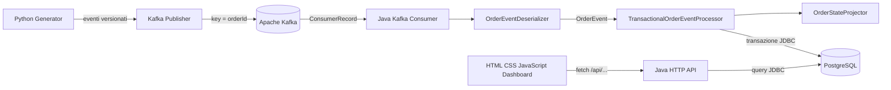

### Responsabilità sintetiche

```text
Python Generator          crea scenari ed eventi logistici
Kafka Publisher           serializza e pubblica gli eventi
Apache Kafka              conserva topic, partizioni e offset
Java Consumer             legge i ConsumerRecord
Deserializer              converte JSON in OrderEvent
Transactional Processor   coordina validazione e transazione
OrderStateProjector       calcola il nuovo stato
PostgreSQL                conserva proiezioni, deduplica e snapshot
HTTP API                  espone lo stato al browser
Dashboard                 visualizza stato corrente e storico
```

---

## 2. Alberatura delle cartelle

```text
orderflow-event-sourcing/
├── docs/
│   ├── 01-kafka-event-streaming.md
│   ├── 02-event-sourcing-cqrs.md
│   ├── 03-producer-consumer-topic-partizioni.md
│   ├── 04-replay-snapshot-idempotenza.md
│   ├── 05-architettura-orderflow.md
│   └── 06-uml-e-mappa-del-software.md
│
├── infra/
│   ├── docker-compose.yml
│   └── postgres/
│       ├── init.sql
│       └── migrations/
│           ├── 001-create-order-projections.sql
│           └── 002-create-order-snapshots.sql
│
├── java-state-reconstructor/
│   ├── pom.xml
│   └── src/
│       ├── main/
│       │   ├── java/it/orderflow/reconstructor/
│       │   │   ├── api/
│       │   │   ├── consumer/
│       │   │   ├── domain/
│       │   │   ├── persistence/
│       │   │   ├── processing/
│       │   │   ├── projection/
│       │   │   ├── replay/
│       │   │   ├── serialization/
│       │   │   └── snapshot/
│       │   └── resources/static/
│       │       ├── index.html
│       │       ├── css/styles.css
│       │       └── js/app.js
│       └── test/
│
├── python-generator/
│   ├── requirements.txt
│   ├── src/orderflow_generator/
│   │   ├── main.py
│   │   ├── batch_main.py
│   │   ├── publish_main.py
│   │   ├── generation/
│   │   └── kafka/
│   └── tests/
│
├── samples/
│   └── scenarios/
│       └── successful-delivery-with-delay.json
│
├── .env.example
├── .gitignore
└── README.md
```

### Dipendenze tra directory

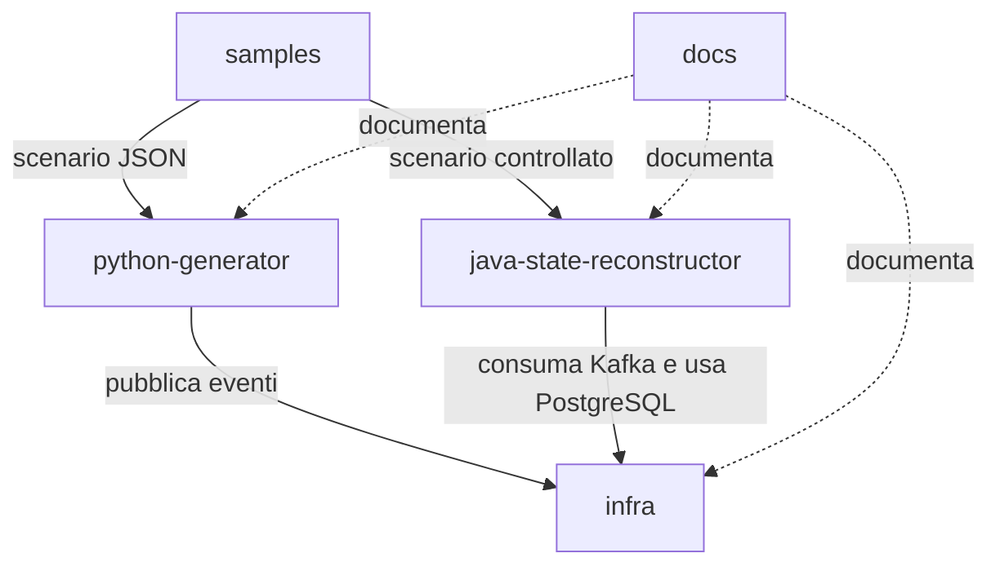

---

## 3. Diagramma dei componenti

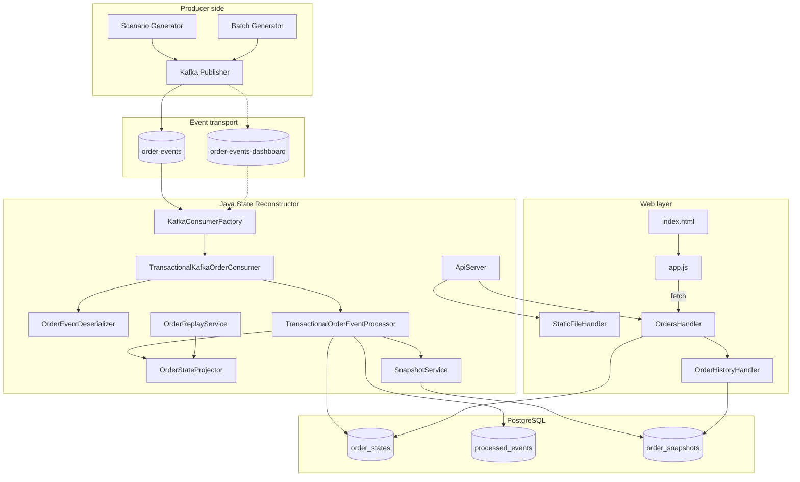

---

## 4. Topic Kafka e flussi

### Topic principale

```text
order-events
```

Uso previsto:

```text
Producer Python
    |
    | key = orderId
    | value = evento JSON
    v
Kafka topic order-events
    |
    v
Consumer Java
```

### Regola di partizionamento

```text
Kafka key = aggregateId = orderId
```

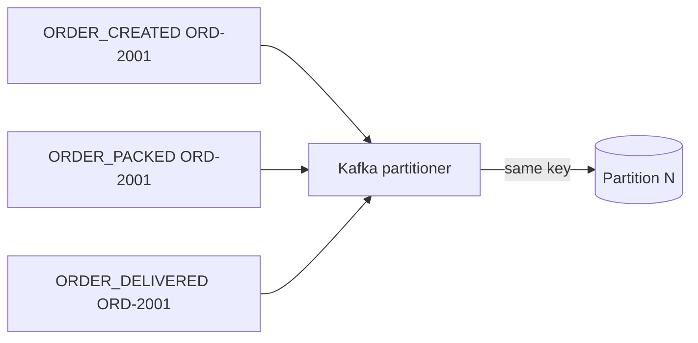

Questa scelta mantiene nella stessa partizione tutti gli eventi dello stesso ordine.

### Configurazione consumer

```text
enable.auto.commit = false
auto.offset.reset = earliest
allow.auto.create.topics = false
key.deserializer = StringDeserializer
value.deserializer = StringDeserializer
```

### Consumer group

```text
order-state-reconstructor
```

Per le prove dashboard può essere usato un gruppo separato:

```text
order-state-reconstructor-dashboard
```

---

## 5. Generatore Python

### Vista dei componenti

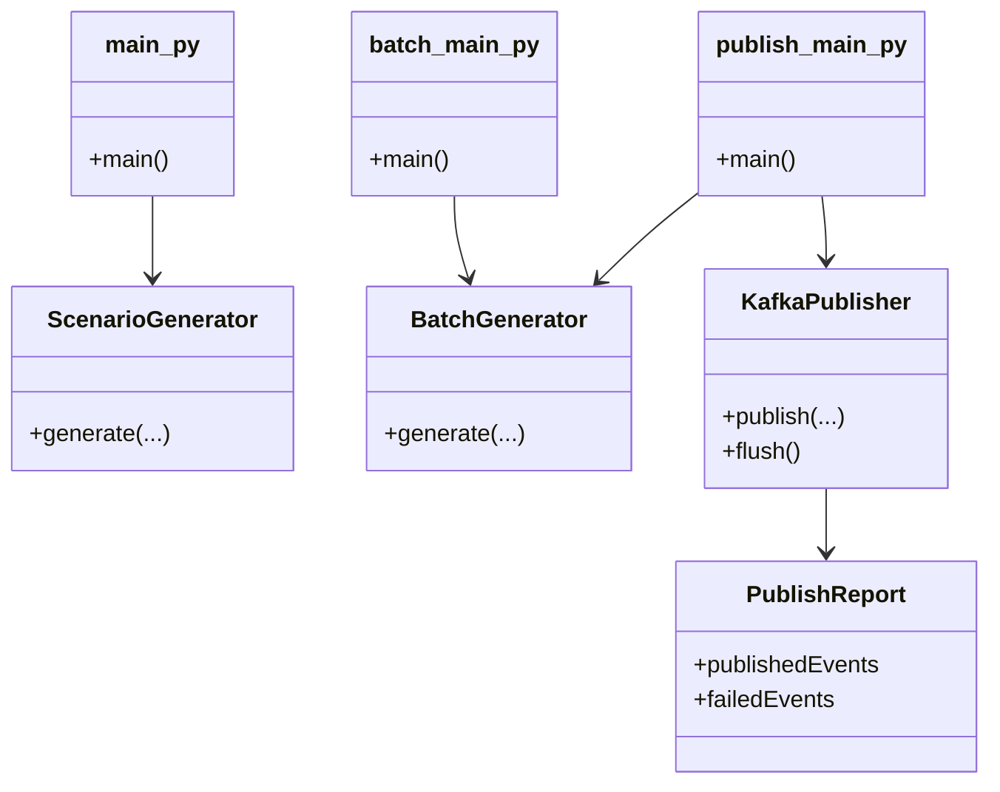


### `main.py`

Responsabilità prevista:

- punto di ingresso per generare uno scenario singolo;
- costruzione degli eventi dell'ordine;
- eventuale scrittura del risultato su file o stdout.

### `batch_main.py`

Responsabilità prevista:

- punto di ingresso per generare più ordini;
- utilizzo del batch generator;
- gestione di seed, quantità e identificatori progressivi.

### `publish_main.py`

Responsabilità prevista:

- generare o caricare eventi;
- configurare Kafka;
- pubblicare i record;
- stampare un report finale.

### `generation/batch_generator.py`

Responsabilità:

- costruire più scenari;
- mantenere coerenza tra ordine, evento e versione;
- produrre un output deterministico quando viene usato lo stesso seed.

### `kafka/publisher.py`

Responsabilità:

```text
OrderEvent
    |
    v
JSON serialization
    |
    v
Kafka producer.send / produce
    |
    | key = orderId
    v
order-events
```

### `kafka/publish_report.py`

Responsabilità:

- contare eventi pubblicati;
- registrare eventuali errori;
- restituire un risultato leggibile al punto di ingresso.

---

## 6. Package Java

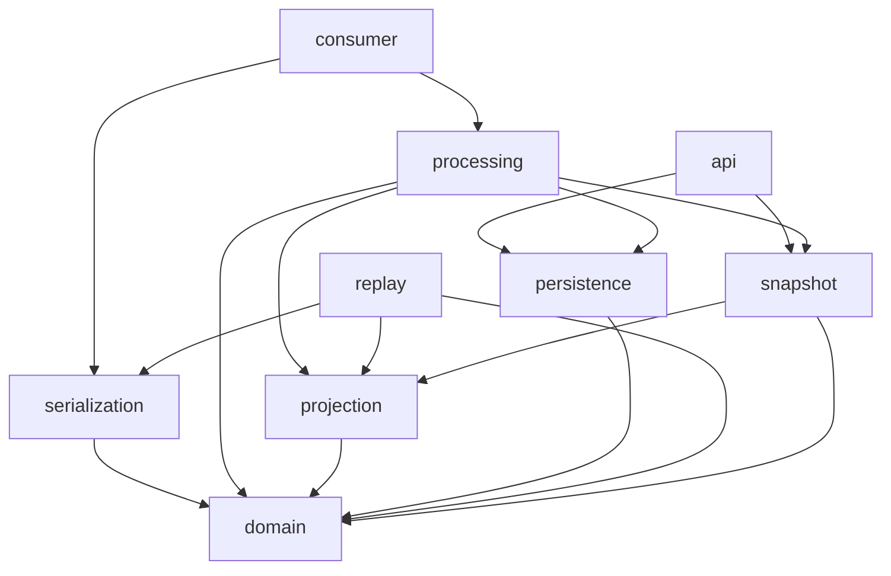

### Significato dei package

```text
domain          modelli ed eventi immutabili
serialization   conversione JSON -> OrderEvent
projection      transizioni di stato
processing      transazione applicativa
a consumer       integrazione Kafka
persistence     accesso JDBC
replay          ricostruzione storica
snapshot        salvataggio e replay ottimizzato
api             server HTTP, endpoint e file statici
```

---

## 7. Dominio e proiezione

### Diagramma delle classi principali

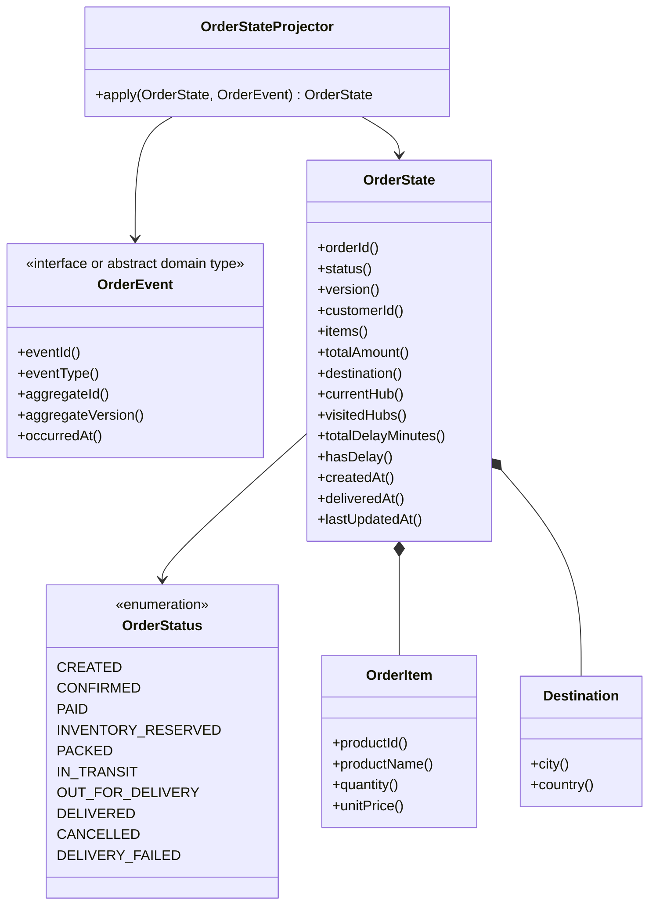

### `OrderStateProjector.apply`

```text
Input:
    stato precedente, anche null
    evento corrente

Controlli:
    aggregateId coerente
    versione attesa
    transizione valida
    stato terminale

Output:
    nuovo OrderState immutabile
```

### Esempio

```text
OrderState(PACKED, v5)
+
SHIPMENT_STARTED(v6)
=
OrderState(IN_TRANSIT, v6)
```

---

## 8. Consumer e processamento transazionale

### Class diagram

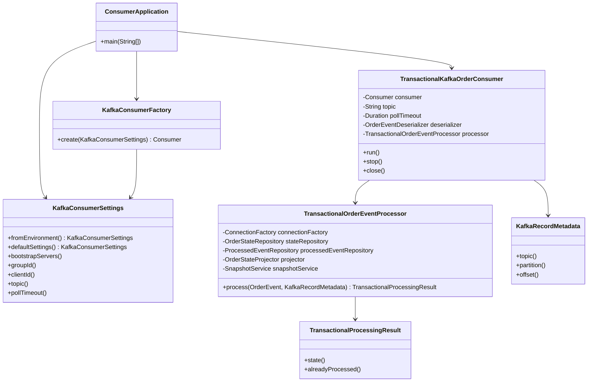

### Flusso del consumer

```text
poll()
  |
  v
for each ConsumerRecord
  |
  +-> deserialize JSON
  +-> validate record.key == aggregateId
  +-> processor.process(event, metadata)
  |
  v
commitSync()
```

### Flusso del processor

```text
open JDBC connection
setAutoCommit(false)
        |
        v
processed event exists?
        |
        +-> yes: return duplicate
        |
        v
load current OrderState
        |
        v
projector.apply
        |
        v
save OrderState
        |
        +-> SnapshotService.createIfRequired
        |
        v
save ProcessedEvent
        |
        v
commit
```

---

## 9. Persistenza PostgreSQL

### Class diagram

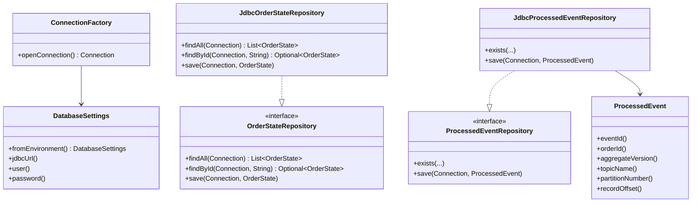

### Tabelle usate

```text
JdbcOrderStateRepository
    -> orderflow.order_states

JdbcProcessedEventRepository
    -> orderflow.processed_events

JdbcOrderSnapshotRepository
    -> orderflow.order_snapshots
```

---

## 10. Replay

### Class diagram

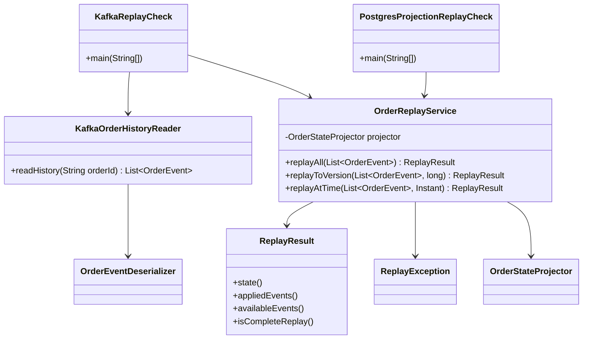

### Modalità

```text
replayAll
    applica tutta la cronologia

replayToVersion
    applica fino alla targetVersion

replayAtTime
    applica fino al targetTime

KafkaOrderHistoryReader
    legge senza committare offset

PostgresProjectionReplayCheck
    elimina e ricostruisce una proiezione
```

---

## 11. Snapshot

### Class diagram

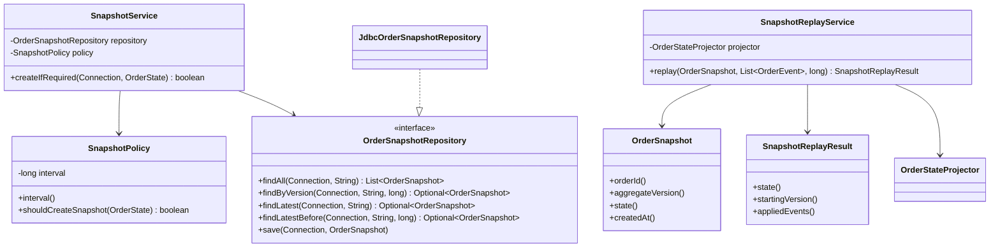

### Policy

```java
state.version() % interval == 0
```

Con intervallo 5:

```text
v5  -> snapshot PACKED
v10 -> snapshot DELIVERED
```

---

## 12. API HTTP e dashboard

### Class diagram API

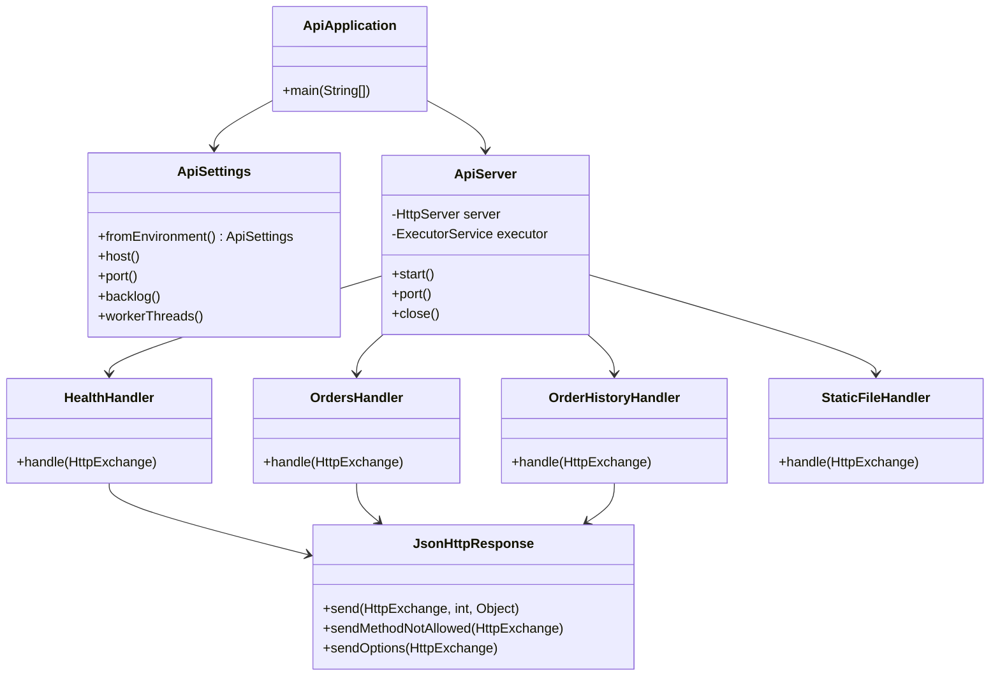

### Routing

```text
/                                      StaticFileHandler
/css/styles.css                        StaticFileHandler
/js/app.js                             StaticFileHandler
/api/health                            HealthHandler
/api/orders                            OrdersHandler
/api/orders/{orderId}                  OrdersHandler
/api/orders/{orderId}/snapshots        OrderHistoryHandler
/api/orders/{orderId}/state?version=N  OrderHistoryHandler
```

### DTO API

```text
HealthResponse
OrderSummaryResponse
SnapshotSummaryResponse
HistoricalStateResponse
```

### JavaScript dashboard

Funzioni principali previste in `app.js`:

```text
requestJson(url)
loadDashboard()
renderHealth()
renderMetrics()
populateStatusFilter()
applyFilters()
renderOrders()
openOrder(orderId)
closeDrawer()
renderOrderDrawer()
loadHistoricalState(orderId, version)
statusBadge(status)
formatStatus(status)
formatAmount(value)
formatDate(value)
escapeHtml(value)
showError(message)
clearError()
```

### Comunicazione frontend-backend

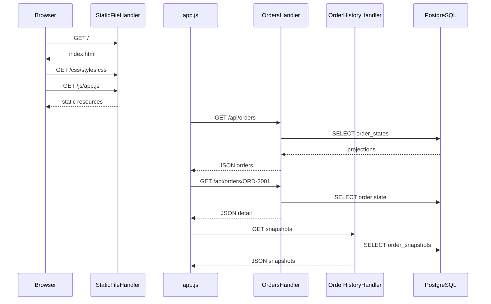

---

## 13. Diagramma ER

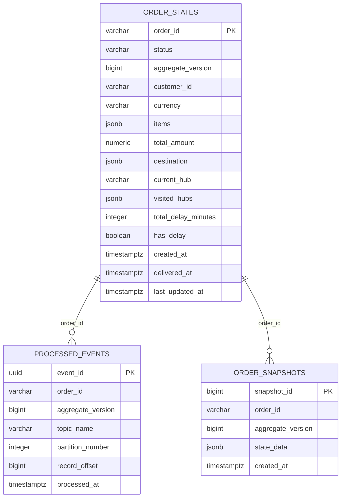

### Relazioni logiche

Le tabelle non devono necessariamente avere foreign key fisiche per rappresentare la relazione. Il collegamento logico avviene tramite:

```text
order_id
```

Vincoli importanti:

```text
processed_events.event_id UNIQUE
processed_events(order_id, aggregate_version) UNIQUE
processed_events(topic, partition, offset) UNIQUE
order_snapshots(order_id, aggregate_version) UNIQUE
```

---

## 14. Sequenze principali

### 14.1 Processamento live Kafka

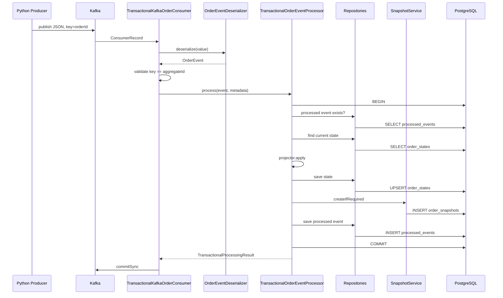

### 14.2 Replay completo

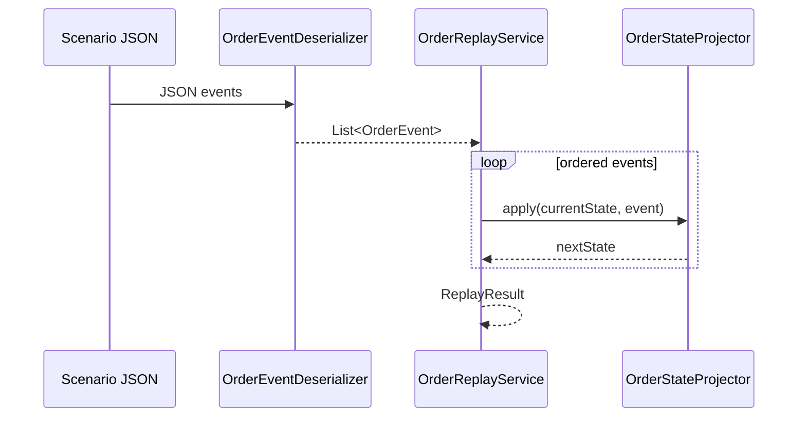

### 14.3 Replay da snapshot

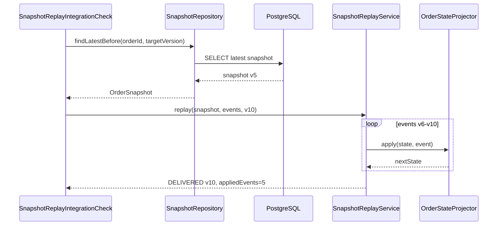